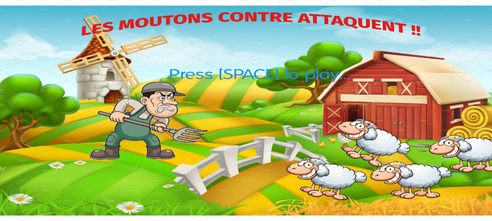

>   Les Moutons Contre Attaquent !!

**How to run the game ?**

Afin installer le jeu, il est nécessaire d’avoir :

-   Un navigateur web supportant la technologie WebGL (Mozilla Firefox, ou
    Chrome par exemple)

-   Un terminal afin d’installer les dépendances

Afin d’installer les dépendances, dans le dossier cloné du jeu, exécutez

`« npm install »`

**How to play the game ?**

Après avoir installé le jeu, ouvrez le fichier index.html avec votre navigateur.
Vous voici attaquez par une horde de mouton de plus en plus féroce ! Défendez
votre ferme de ces innombrables ennemis qui veulent votre peau ! Pour cela, rien
de plus simple : vous êtes équipé d’un pistoler a munition illimité accessible
avec la barre espace du clavier. Vous pouvez vous déplacer verticalement dans
votre champ avec au choix : les touches fléchées ou bien avec les touches Z et
S.
